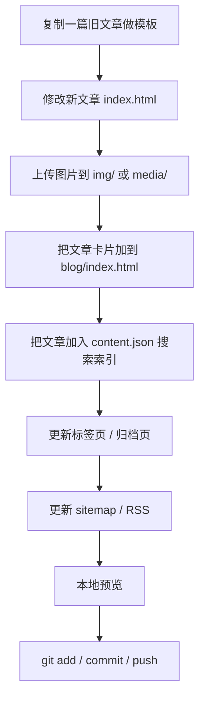
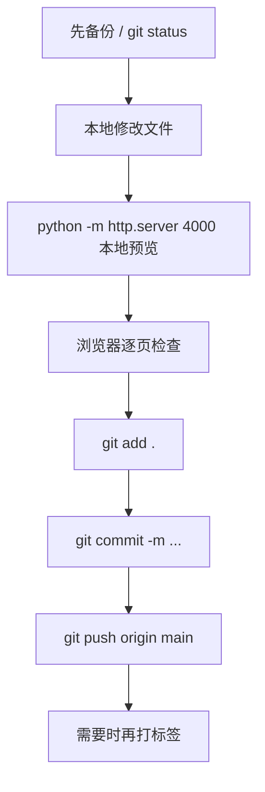

# 个人博客运维手册（小白版）

这是一份给“完全不懂代码也能照着做”的博客维护说明书。  
你当前博客项目的本地目录是：

```text
D:\blog\Minmin0101.github.io
```

如果你后面忘了某个内容该去哪里改，先回到这份 `README.md` 看，一般都能找到。
为了方便你直接在电脑里定位文件，下面文中提到的关键文件路径，我都尽量改成了你本机可用的绝对路径显示。


## 0. 先看一眼网站现在是什么样

下面这些图，是我在 `2026-03-23` 本地启动博客后，用无头 Edge 从 `http://127.0.0.1:4030/` 截下来的。  
截图文件都放在：

```text
D:\blog\Minmin0101.github.io\img\posts\2026-03-23-blog-maintenance-readme\screens
```

### 0.1 入口首页


### 0.2 博客首页（桌面端）


### 0.3 微博页（桌面端）


### 0.4 运维手册文章页（桌面端）


### 0.5 博客首页（移动端）


---

## 1. 先搞清楚：这个项目是什么

这个仓库 **不是“Hexo 源码工程”**，而是一个已经生成好的 **静态网站成品**。

这句话很重要，它意味着：

1. 你改的是网页文件本身，不是“配置完自动生成”的源码。
2. 很多页面内容是重复写死在不同 HTML 文件里的。
3. 这里现在有两套发文方式：
   - 如果你走旧的“手工改 HTML”方式，新文章不会自动更新博客列表、标签页、搜索索引、站点地图，通常需要你手动补几处文件。
   - 如果你走现在推荐的“Markdown 发文流程”，只要把文章放进 `D:\blog\Minmin0101.github.io\markdown-posts`，再运行 `D:\blog\Minmin0101.github.io\build-markdown-posts.bat`，或者直接推送到 GitHub，博客首页、最新文章、标签页、归档页、搜索索引、RSS、站点地图都会自动更新。

你可以把它理解成：

- `D:\blog\Minmin0101.github.io\index.html` 是首页门户
- `D:\blog\Minmin0101.github.io\blog\index.html` 是博客首页
- `D:\blog\Minmin0101.github.io\2026\...\index.html` 是每一篇文章详情页
- `D:\blog\Minmin0101.github.io\blog\weibo\index.html` 是微博页
- `D:\blog\Minmin0101.github.io\gallery\index.html` 是相册页
- `D:\blog\Minmin0101.github.io\about\index.html`、`D:\blog\Minmin0101.github.io\projects\index.html`、`D:\blog\Minmin0101.github.io\thinking\index.html` 是独立菜单页

---

## 2. 这份手册怎么用

如果你只想做某一件事，可以直接跳到对应章节：

- 修改站名、座右铭、入口按钮、头像：看“5. 站点基础信息怎么改”
- 修改每个菜单页的介绍：看“6. 各菜单页怎么改”
- 发布博客文章：看“7. 如何写并发布博客文章”
- 添加标签：看“8. 如何添加标签”
- 发布微博：看“9. 如何写并发布微博”
- 新建相册、上传图片：看“10. 如何新建相册并上传图片”
- 发布到 GitHub Pages：看“12. 如何部署到 GitHub Pages”
- 打版本号：看“13. 如何打版本号”
- 微博登录坏了：看“14. 微博登录与 GitHub OAuth 维护”

---

## 3. 推荐环境

为了后续维护轻松一些，建议你电脑上至少装这 4 个东西。

### 3.1 必装软件

1. `Git for Windows`
   用来提交、推送代码到 GitHub。

2. `VS Code`
   用来打开和编辑项目文件。

3. `Python 3`
   用来本地预览网站。

4. `浏览器`
   推荐 Edge 或 Chrome。

### 3.2 选装软件

1. `Node.js`
   只有你维护微博登录的 Cloudflare Worker 时才需要。

2. `Cloudflare 账号`
   只有你维护微博页 GitHub 登录时才需要。

---

## 4. 项目目录总览

下面这张“地图”非常重要，后面所有修改基本都围绕这些目录展开。

```text
D:\blog\Minmin0101.github.io\
├─ index.html                          # 根首页 / 个人门户页
├─ blog/
│  ├─ index.html                       # 博客首页
│  └─ weibo/
│     ├─ index.html                    # 微博页
│     ├─ issues-cache.json             # 微博缓存数据
│     ├─ comments-cache.json           # 微博评论缓存数据
│     └─ oauth-callback/
│        └─ index.html                 # 微博登录回调页
├─ 2026/                               # 博客文章详情页目录
├─ about/index.html                    # 关于页
├─ projects/index.html                 # 项目页
├─ thinking/index.html                 # 思考页
├─ build-gallery.bat                   # 相册一键构建脚本
├─ gallery/index.html                  # 相册页
├─ gallery/gallery-albums.txt          # 相册配置文件
├─ archives/                           # 归档页
├─ tags/                               # 标签页总目录
├─ img/                                # 常规图片资源
├─ img/gallery/                        # 相册图片目录
├─ media/                              # 动图、视频等资源
├─ css/                                # 全站样式
├─ js/                                 # 全站脚本
├─ content.json                        # 搜索索引
├─ rss2.xml                            # RSS
├─ sitemap.xml                         # 站点地图
├─ sitemap.txt                         # 简版站点地图
└─ serverless/
   └─ github-oauth-worker/             # 微博页 GitHub 登录 Worker
```

### 4.1 关键文件一览表

| 你要做什么 | 主要文件 |
| --- | --- |
| 改首页站名、座右铭、入口按钮 | `D:\blog\Minmin0101.github.io\index.html` |
| 改博客首页文案 | `D:\blog\Minmin0101.github.io\blog\index.html` |
| 改微博页文案与配置 | `D:\blog\Minmin0101.github.io\blog\weibo\index.html` |
| 改微博样式与交互 | `D:\blog\Minmin0101.github.io\css\weibo-gwitter.css`、`D:\blog\Minmin0101.github.io\js\weibo-gwitter.js` |
| 改相册内容 | `D:\blog\Minmin0101.github.io\build-gallery.bat`、`D:\blog\Minmin0101.github.io\gallery\gallery-albums.txt`、`D:\blog\Minmin0101.github.io\gallery\index.html` |
| 改关于页 | `D:\blog\Minmin0101.github.io\about\index.html` |
| 改项目页 | `D:\blog\Minmin0101.github.io\projects\index.html` |
| 改思考页 | `D:\blog\Minmin0101.github.io\thinking\index.html` |
| 改搜索 | `D:\blog\Minmin0101.github.io\content.json`、`D:\blog\Minmin0101.github.io\js\search-fuzzy.js`、`D:\blog\Minmin0101.github.io\css\search-fuzzy.css` |
| 改头像 | `D:\blog\Minmin0101.github.io\img\avatar.png` |
| 改网站图标 | `D:\blog\Minmin0101.github.io\img\favicon1.ico` |
| 改微信二维码 | `D:\blog\Minmin0101.github.io\img\wechat_channel.jpg` |
| 改打赏二维码 | `D:\blog\Minmin0101.github.io\img\wechatpay.png`、`D:\blog\Minmin0101.github.io\img\alipay.png` |
| 改微博登录 Worker | `D:\blog\Minmin0101.github.io\serverless\github-oauth-worker` |

### 4.2 一个很重要的小提示

这个项目里很多 HTML 文件是 **压缩成一行** 的，所以你打开时会觉得很乱。  
这不是你弄坏了，是文件本来就这样。

建议操作方式：

1. 在 VS Code 里打开项目
2. 直接用“全局搜索”找关键词
3. 找到后改文字，不要执着于行号

常用搜索关键词：

- `衰小孩`
- `热爱分享`
- `PRESS START`
- `为什么要记录微博`
- `文章记录 / 生活切片 / 思考沉淀`
- `欢迎添加我的微信`
- `mail.qq.com`
- `https://github.com/Minmin0101`

---

## 5. 环境搭建与本地预览

### 5.1 第一次打开项目

在 PowerShell 里执行：

```powershell
cd D:\blog\Minmin0101.github.io
code .
```

如果 `code .` 没反应，就直接手动打开 VS Code，然后“文件 -> 打开文件夹”，选择：

```text
D:\blog\Minmin0101.github.io
```

### 5.2 本地预览网站

推荐最简单的预览方式：

```powershell
cd D:\blog\Minmin0101.github.io
python -m http.server 4000
```

然后浏览器打开：

```text
http://127.0.0.1:4000/
```

常用页面地址：

- 首页：`http://127.0.0.1:4000/`
- 博客：`http://127.0.0.1:4000/blog/`
- 微博：`http://127.0.0.1:4000/blog/weibo/`
- 相册：`http://127.0.0.1:4000/gallery/`

### 5.3 如果端口 4000 被占用

可以换成别的端口，比如 4010：

```powershell
cd D:\blog\Minmin0101.github.io
python -m http.server 4010
```

然后打开：

```text
http://127.0.0.1:4010/
```

---

## 6. 站点基础信息怎么改

这一章解决这些问题：

- 怎么改站名
- 怎么改首页句子 / 座右铭
- 怎么改入口标签名
- 怎么改头像
- 怎么改 favicon
- 怎么改邮箱 / GitHub / 微博链接
- 怎么改左侧菜单栏文字

### 6.1 修改站名

最常改的地方有 2 组：

1. 首页门户名称
2. 博客和其他页面左侧侧边栏名称

#### 首页门户名称

文件：

- `D:\blog\Minmin0101.github.io\index.html`

搜索这些关键词：

```html
<title>衰小孩 | 热爱分享 & 生活记录</title>
<h2 class="content-title">衰小孩</h2>
<h1>衰小孩</h1>
```

把 `衰小孩` 改成你想要的新名字即可。

#### 博客和各内容页名称

文件通常包括：

- `D:\blog\Minmin0101.github.io\blog\index.html`
- `D:\blog\Minmin0101.github.io\about\index.html`
- `D:\blog\Minmin0101.github.io\projects\index.html`
- `D:\blog\Minmin0101.github.io\thinking\index.html`
- `D:\blog\Minmin0101.github.io\gallery\index.html`
- 各文章页 `2026/.../index.html`

搜索关键词：

```text
衰小孩
```

把页面里的名字替换成你的新站名即可。

### 6.2 修改首页座右铭 / 句子

文件：

- `D:\blog\Minmin0101.github.io\index.html`

搜索这两个字段：

```html
<h3 class="content-subtitle" original-content="“如果你有勇气，我就陪你打断婚车的车轴”--《龙族》楚子航">
<h2 id="signature" original-content="「热爱分享 | 生活记录」">
```

你可以把 `original-content` 里的内容改成自己的。

例如：

```html
<h3 class="content-subtitle" original-content="想把今天的风和心情都认真存档。">
<h2 id="signature" original-content="「生活记录 | 学习分享 | 慢慢生长」">
```

### 6.3 修改首页入口标签名

首页的入口按钮在：

- `D:\blog\Minmin0101.github.io\index.html`

搜索：

```html
<ul class="portal-links">
```

你会看到类似内容：

```html
<span class="nav-text">博客</span>
<span class="nav-text">微博</span>
<span class="nav-text">关于</span>
<span class="nav-text">相册</span>
<span class="nav-text">项目</span>
<span class="nav-text">思考</span>
```

把这些文字改成你想要的名字即可。

例如：

- `博客` 改成 `文章`
- `思考` 改成 `碎碎念`
- `项目` 改成 `作品`

### 6.4 修改首页按钮文字

文件：

- `D:\blog\Minmin0101.github.io\index.html`

搜索：

```html
PRESS START
```

比如可以改成：

```html
ENTER
开始进入
点我开始
```

### 6.5 修改头像

最省事的做法不是改代码，而是 **直接替换同名文件**。

当前头像文件：

- `D:\blog\Minmin0101.github.io\img\avatar.png`

建议操作：

1. 准备一张新的头像图片
2. 把它改名为 `avatar.png`
3. 直接覆盖项目里的这个文件

这样做的好处：

- 不需要全站到处改图片路径
- 首页、博客、关于页、相册页、头像预览会一起更新

### 6.6 修改网站图标 favicon

文件：

- `D:\blog\Minmin0101.github.io\img\favicon1.ico`

最简单做法：

1. 准备新的 `.ico` 图标
2. 命名成 `favicon1.ico`
3. 覆盖原文件

### 6.7 修改微信二维码、打赏二维码

微信二维码：

- `D:\blog\Minmin0101.github.io\img\wechat_channel.jpg`

微信打赏码：

- `D:\blog\Minmin0101.github.io\img\wechatpay.png`

支付宝打赏码：

- `D:\blog\Minmin0101.github.io\img\alipay.png`

同样建议直接用同名图片覆盖。

### 6.8 修改左侧社交链接

当前常见链接分布在很多 HTML 页面中，最简单的方法是 **全局搜索并替换**。

常见值：

```text
https://mail.qq.com/
https://github.com/Minmin0101
https://weibo.com/u/x
```

推荐在 VS Code 里按：

```text
Ctrl + Shift + F
```

然后搜索并替换。

#### 这些链接分别代表什么

- `https://mail.qq.com/`：邮箱入口
- `https://github.com/Minmin0101`：GitHub 主页
- `https://weibo.com/u/x`：微博主页

### 6.9 修改左侧菜单栏标签

左侧菜单不是只在一个文件里，而是很多页面都各自写了一份。

常见菜单文字：

```text
主 页
归 档
标 签
微 博
相 册
关 于
项 目
思 考
导 航
```

#### 推荐改法

用 VS Code 全局搜索这些词，然后统一替换。

#### 需要重点检查的页面

- `D:\blog\Minmin0101.github.io\blog\index.html`
- `D:\blog\Minmin0101.github.io\about\index.html`
- `D:\blog\Minmin0101.github.io\projects\index.html`
- `D:\blog\Minmin0101.github.io\thinking\index.html`
- `D:\blog\Minmin0101.github.io\gallery\index.html`
- `D:\blog\Minmin0101.github.io\blog\weibo\index.html`
- 所有文章详情页 `2026/.../index.html`

#### 小提醒

改菜单名字后，最好每个页面都本地点一遍，避免某些页面菜单文字没同步。

---

## 7. 各菜单页怎么改

这一章对应：

- 关于页
- 项目页
- 思考页
- 相册页
- 微博页介绍文字
- 博客首页介绍文字

---

### 7.1 关于页

文件：

- `D:\blog\Minmin0101.github.io\about\index.html`

重点改 3 处：

1. 页面标题
2. 页面副标题
3. 页面正文介绍

搜索关键词：

```text
认识一下我和这个博客
你好，我是
这个博客主要用来记录三类内容
```

真正的正文区域是：

```html
<div class="post-content page-content" id="page-content">
```

你想改介绍内容，主要就是改这个区域里的 HTML。

---

### 7.2 项目页

文件：

- `D:\blog\Minmin0101.github.io\projects\index.html`

搜索关键词：

```text
做过的项目、练习与长期更新计划
```

正文内容同样在：

```html
<div class="post-content page-content" id="page-content">
```

---

### 7.3 思考页

文件：

- `D:\blog\Minmin0101.github.io\thinking\index.html`

搜索关键词：

```text
稍微慢一点写下来的想法与阶段总结
这里适合放更完整的阶段总结
```

---

### 7.4 相册页介绍

文件：

- `D:\blog\Minmin0101.github.io\gallery\gallery-albums.txt`
- `D:\blog\Minmin0101.github.io\build-gallery.bat`
- `D:\blog\Minmin0101.github.io\gallery\index.html`

可以改的地方包括：

- 页面副标题
- 相册总览说明
- 相册统计文字
- 相册说明段落
- 每本相册的名字、简介、封面、照片标题和描述

搜索关键词：

```text
这里放生活切片、界面草稿和想留下来的旅途画面。
把生活碎片收进相册里，想看的时候就翻出来。
目前收录
每一本相册都可以继续往里加照片
page_subtitle=
overview_title=
photo=
```

---

### 7.5 微博页介绍

文件：

- `D:\blog\Minmin0101.github.io\blog\weibo\index.html`

你现在能直接改到这些位置：

- 顶部引导文案
- 折叠介绍标题
- 折叠介绍正文
- 标签云

搜索关键词：

```text
终于明白为什么有人会说
为什么要记录微博
为什么要记录生活
都有什么内容
```

---

### 7.6 博客首页介绍

文件：

- `D:\blog\Minmin0101.github.io\blog\index.html`

搜索关键词：

```text
文章记录 / 生活切片 / 思考沉淀
沿着时间往下翻，就是这段时间留下来的思考与记录。
目前共收录
```

你可以修改：

- 博客页副标题
- 博客首页介绍句
- 文章数量显示文字

---

## 8. 如何写并发布博客文章

先看最重要的一句：

现在这套博客已经支持“小白模式”发文了。
以后默认新增一篇博客文章，你只需要：

1. 在 `D:\blog\Minmin0101.github.io\markdown-posts` 里新增 1 个 `.md` 文件
2. 改好标题、日期、标签和正文
3. 本地双击 `D:\blog\Minmin0101.github.io\build-markdown-posts.bat`，或者直接推送到 GitHub

脚本会自动帮你生成：

- 新文章详情页
- `D:\blog\Minmin0101.github.io\blog\index.html` 里的文章卡片
- `D:\blog\Minmin0101.github.io\archives\index.html` 归档
- `D:\blog\Minmin0101.github.io\tags\index.html` 和对应标签页
- `D:\blog\Minmin0101.github.io\content.json` 搜索索引
- `D:\blog\Minmin0101.github.io\rss2.xml`
- `D:\blog\Minmin0101.github.io\sitemap.xml`
- `D:\blog\Minmin0101.github.io\sitemap.txt`

而且会继续复用你现在博客的现有页面结构，所以 PC、移动端、iOS 端样式都会跟现有文章页保持一致。

### 8.0 现在最推荐的发文方式：只上传一个 Markdown 文件

你只需要记住这 7 个位置：

- `D:\blog\Minmin0101.github.io\markdown-posts`
  这里放你以后新写的 Markdown 文章
- `D:\blog\Minmin0101.github.io\markdown-posts\_template.md`
  这是模板说明入口，会告诉你该选哪一种模板
- `D:\blog\Minmin0101.github.io\markdown-posts\_template-with-toc.md`
  这是带目录长文模板，适合教程、总结、长文回顾
- `D:\blog\Minmin0101.github.io\markdown-posts\_template-no-toc.md`
  这是普通无目录模板，适合日常记录、随笔、短中篇分享
- `D:\blog\Minmin0101.github.io\img\posts\_template-assets`
  这是模板默认图片素材目录
- `D:\blog\Minmin0101.github.io\media\posts\_template-assets`
  这是模板默认 GIF / 视频素材目录
- `D:\blog\Minmin0101.github.io\build-markdown-posts.bat`
  本地一键生成文章的脚本
- `D:\blog\Minmin0101.github.io\.github\workflows\build-markdown-posts.yml`
  推到 GitHub 后自动生成文章的工作流

### 8.0.1 小白最简单步骤

#### 第一步：先选模板，再复制

如果你想写的是长文、教程、复盘、读书总结，选这个：

- `D:\blog\Minmin0101.github.io\markdown-posts\_template-with-toc.md`

它会保留右侧目录，因为 front matter 里已经带了这一行：

```yaml
template_path: 2026/03/12/post-interaction-long-test/index.html
```

如果你想写的是普通随笔、生活记录、短中篇分享，选这个：

- `D:\blog\Minmin0101.github.io\markdown-posts\_template-no-toc.md`

它不会显示右侧目录，更适合日常文章。

复制后，把文件改成你自己的名字，例如：

- `D:\blog\Minmin0101.github.io\markdown-posts\2026-03-23-我的新文章.md`

如果你想直接用命令复制，可以这样：

```powershell
cd D:\blog\Minmin0101.github.io
Copy-Item .\markdown-posts\_template-with-toc.md .\markdown-posts\2026-03-23-我的长文.md
Copy-Item .\markdown-posts\_template-no-toc.md .\markdown-posts\2026-03-23-我的随笔.md
```

小白最好直接记住这句：

- 要目录，就复制 `_template-with-toc.md`
- 不要目录，就复制 `_template-no-toc.md`

#### 第二步：改这些字段

模板开头这段叫 front matter：

```yaml
---
title: 你的文章标题
date: 2026-03-23 20:00
updated: 2026-03-23 20:00
slug: my-new-post
summary: 这里写摘要
tags:
  - 生活记录
  - 随笔
cover: /img/posts/your-cover.jpg
cover_alt: 文章封面
---
```

这些字段分别是什么意思：

- `title`
  文章标题，会显示在文章页、博客首页、归档页、搜索结果里
- `date`
  发布时间，决定文章排序和文章 URL 里的年月日
- `updated`
  最后更新时间
- `slug`
  文章网址最后那一段，建议只写英文、数字、中划线
- `summary`
  摘要，会显示在博客列表和搜索结果里
- `tags`
  标签列表，会自动生成到标签页里
- `cover`
  封面图路径，可留空；如果留空，系统会自动用现有博客卡片那种画布封面
- `cover_alt`
  封面图描述文字

封面图现在怎么改最省事：

- 新文章：直接改你这篇 Markdown 文章开头的 `cover:` 和 `cover_alt:`
- 封面图片文件建议先放到 `D:\blog\Minmin0101.github.io\img\posts\你的文章目录\`
- 例如你先把图片放到 `D:\blog\Minmin0101.github.io\img\posts\2026-03-23-my-first-post\cover.jpg`
- 然后在文章 front matter 里写：`cover: /img/posts/2026-03-23-my-first-post/cover.jpg`
- README 这篇文章当前就改这里：`D:\blog\Minmin0101.github.io\markdown-posts\2026-03-23-blog-maintenance-readme.md`

要注意一件事：

- 现在旧文章首页卡片也已经统一切到 Markdown 生成卡片了
- 也就是说，你现在改旧文章 Markdown 里的 `cover:`，博客首页卡片封面也会一起跟着变
- 如果 `cover:` 留空，首页卡片就会自动回退到当前博客那种画布封面

#### 第三步：写正文

front matter 下面就是正常 Markdown 正文，你可以直接写：

- 标题
- 段落
- 图片
- 代码块
- 表格
- 数学公式

如果你只是想先快速预览，模板里已经自带一套可用素材：

- `D:\blog\Minmin0101.github.io\img\posts\_template-assets`
- `D:\blog\Minmin0101.github.io\media\posts\_template-assets`

如果你要正式发自己的文章，推荐把图片和视频放到：

- `D:\blog\Minmin0101.github.io\img`
- `D:\blog\Minmin0101.github.io\media`

例如：

```markdown

```

#### 第四步：生成文章

你有两种方法。

方法 A：本地生成

直接双击：

- `D:\blog\Minmin0101.github.io\build-markdown-posts.bat`

或者命令行运行：

```powershell
cd D:\blog\Minmin0101.github.io
.\build-markdown-posts.bat
```

方法 B：直接推送到 GitHub

只要你把新 Markdown 文件推到仓库，GitHub Actions 就会自动运行：

- `D:\blog\Minmin0101.github.io\.github\workflows\build-markdown-posts.yml`

它会自动生成新文章页面并提交回仓库。

### 8.0.2 生成后你会看到什么

如果你新建了：

- `markdown-posts/2026-03-23-我的新文章.md`

并且里面写的是：

- `date: 2026-03-23 20:00`
- `slug: my-new-post`

那么脚本会自动生成：

- `D:\blog\Minmin0101.github.io\2026\03\23`
- `D:\blog\Minmin0101.github.io\blog\index.html`
- `D:\blog\Minmin0101.github.io\archives\index.html`
- `D:\blog\Minmin0101.github.io\tags\index.html`
- 对应标签页，比如 `D:\blog\Minmin0101.github.io\tags\生活记录\index.html`
- `D:\blog\Minmin0101.github.io\content.json`
- `D:\blog\Minmin0101.github.io\rss2.xml`
- `D:\blog\Minmin0101.github.io\sitemap.xml`

### 8.0.3 以后你尽量不要再手改这些文件

用了这套 Markdown 发文流程后，新增文章时尽量不要再手改下面这些文件：

- `D:\blog\Minmin0101.github.io\blog\index.html`
- `D:\blog\Minmin0101.github.io\archives\index.html`
- `D:\blog\Minmin0101.github.io\tags\index.html`
- `D:\blog\Minmin0101.github.io\content.json`
- `D:\blog\Minmin0101.github.io\rss2.xml`
- `D:\blog\Minmin0101.github.io\sitemap.xml`

因为这些文件现在会由脚本自动维护。

### 8.0.4 旧方法还保留，但只当备用

下面 8.1 到 8.12 里原来的手工 HTML 做法我先保留着，主要是为了你以后万一要修旧文章、抢救页面或者手工排查时还能参考。
但以后“新增一篇新文章”，默认优先走上面这套 Markdown 流程就够了。

这是整个站最需要你熟悉的一章。

### 8.1 先理解博客文章的结构

每篇文章都有自己的独立目录，路径长这样：

```text
D:\blog\Minmin0101.github.io\2026\03\12\post-interaction-long-test\index.html
```

也就是：

```text
年 / 月 / 日 / 文章英文路径 / index.html
```

例如一篇新文章可以做成：

```text
D:\blog\Minmin0101.github.io\2026\03\23\my-first-post\index.html
```

### 8.2 旧方法（备用）：手动复制现有 HTML 文章模板

最简单的方法是复制一篇现有文章，然后改里面的标题和正文。

推荐拿这篇做模板：

- `D:\blog\Minmin0101.github.io\2026\01\23\hello-world\index.html`

#### 复制文章模板命令

```powershell
cd D:\blog\Minmin0101.github.io
Copy-Item -Recurse ".\2026\01\23\hello-world" ".\2026\03\23\my-first-post"
```

然后去改新文件：

- `D:\blog\Minmin0101.github.io\2026\03\23\my-first-post\index.html`

### 8.3 文章里通常要改哪些内容

打开新文章后，搜索这些关键词并替换：

```text
你好，世界
这是博客重构后的第一篇文章
2026-01-23
衰小孩
生活
建站
```

一般要改的内容包括：

1. 页面 `<title>`
2. `meta description`
3. 文章标题
4. 发布时间
5. 正文内容
6. 标签
7. 封面图

### 8.4 图片、动图、视频往哪里放

推荐放在：

- `img/`：普通图片
- `media/`：GIF、MP4、较大的媒体资源

建议你自己整理子目录，后面不容易乱。

例如：

```text
D:\blog\Minmin0101.github.io\img\posts\2026-03-23-my-first-post\cover.jpg
D:\blog\Minmin0101.github.io\img\posts\2026-03-23-my-first-post\figure-1.jpg
D:\blog\Minmin0101.github.io\media\posts\2026-03-23-my-first-post\demo.gif
D:\blog\Minmin0101.github.io\media\posts\2026-03-23-my-first-post\demo.mp4
```

然后在文章里引用：

```html

```

### 8.5 只新增文章详情页还不够

因为这是静态站，**新文章不会自动出现在博客首页**。  
你还需要至少补这几处：

1. 博客首页文章卡片
2. 博客首页“最新文章”列表
3. 搜索索引 `content.json`
4. 标签页
5. 归档页
6. 站点地图
7. RSS

下面一项一项讲。

---

### 8.6 把新文章加到博客首页

文件：

- `D:\blog\Minmin0101.github.io\blog\index.html`

你需要改 3 个地方：

#### 1. 最新文章弹层

搜索：

```text
latest-posts-list
```

你会看到类似：

```html
<li class="latest-posts-item">
  <a class="latest-posts-link" href="/2026/03/12/post-interaction-long-test/">
```

照着新增一条即可。

#### 2. 主文章列表

搜索：

```text
<ul class="post-list rich-post-list"
```

这里面每个 `<li class="post-list-item">` 就是一篇文章卡片。

你可以复制一整块文章卡片，改成新文章的信息。

#### 3. 文章数量

搜索：

```text
目前共收录 6 篇文章
```

如果新增一篇，就改成：

```text
目前共收录 7 篇文章
```

---

### 8.7 把新文章加到搜索里

文件：

- `D:\blog\Minmin0101.github.io\content.json`

这个文件决定搜索框能不能搜到你的新文章。

结构长这样：

```json
{
  "posts": [
    {
      "title": "文章标题",
      "path": "2026/03/23/my-first-post/",
      "date": "2026-03-23T10:00:00.000Z",
      "tags": [
        { "name": "生活记录" },
        { "name": "随笔" }
      ],
      "text": "文章摘要和正文关键内容"
    }
  ]
}
```

#### 你要改什么

在 `posts` 数组里新增一项，至少写上：

1. `title`
2. `path`
3. `date`
4. `tags`
5. `text`

#### 最简单做法

复制最后一篇文章对象，改成你的内容。

---

### 8.8 添加文章标签

文章标签会出现 3 个地方：

1. 文章详情页
2. 博客首页卡片
3. 标签页

#### 文章详情页标签

在文章自己的 `index.html` 里搜索：

```text
article-tag-list
```

复制已有标签链接改名字即可。

#### 博客首页卡片标签

在 `D:\blog\Minmin0101.github.io\blog\index.html` 的对应文章卡片中，搜索：

```text
article-tag-list-link
```

照着新增或修改。

---

### 8.9 给标签建立独立页面

标签目录在：

- `D:\blog\Minmin0101.github.io\tags`

现有标签有这些：

```text
CSS
Hexo
Markdown
主题改造
化学符号
响应式
多媒体
建站
数学公式
测试文章
生活
生活记录
随笔
```

#### 如果你要新增一个从未存在过的新标签

比如你要新增标签 `旅行`，推荐做法：

1. 复制一个已有标签目录
2. 改成新标签名
3. 修改标签页里的标题与文章列表

例如：

```powershell
cd D:\blog\Minmin0101.github.io
Copy-Item -Recurse ".\tags\生活" ".\tags\旅行"
```

然后编辑：

- `D:\blog\Minmin0101.github.io\tags\旅行\index.html`

把里面的：

- 标签名字
- 标签文章数量
- 标签下的文章列表

改成你的新标签内容。

#### 标签总览页

总标签页在：

- `D:\blog\Minmin0101.github.io\tags\index.html`

如果你新增了标签，也要把总览页一起补上。

---

### 8.10 更新归档页

归档页目录：

- `D:\blog\Minmin0101.github.io\archives`

常用文件：

- `D:\blog\Minmin0101.github.io\archives\index.html`

如果新增文章，建议同步补到归档页里。

搜索关键词：

```text
文章标题
2026
03
```

通常复制现有归档条目，改标题和链接即可。

---

### 8.11 更新 RSS 和 sitemap

文件：

- `D:\blog\Minmin0101.github.io\rss2.xml`
- `D:\blog\Minmin0101.github.io\sitemap.xml`
- `D:\blog\Minmin0101.github.io\sitemap.txt`

#### 为什么要改

- RSS：订阅器会用到
- sitemap：搜索引擎会用到

#### 最低要求

新增文章后，把文章 URL 至少加进：

- `sitemap.xml`
- `sitemap.txt`

例如：

```text
https://minmin0101.github.io/2026/03/23/my-first-post/
```

---

### 8.12 发布文章的完整流程图



---

## 9. 如何写并发布微博

你的微博页不是传统微博后台，而是：

**GitHub Issues = 微博内容源**

也就是说：

- 你在 GitHub 仓库里新建一条 Issue
- 它就会显示在微博页里

### 9.1 微博对应哪个仓库

当前微博页配置在：

- `D:\blog\Minmin0101.github.io\blog\weibo\index.html`

其中这段配置决定仓库：

```js
window.MINMIN_WEIBO_CONFIG = {
  owner: "Minmin0101",
  repo: "Minmin0101.github.io"
}
```

也就是这个仓库：

- `Minmin0101/Minmin0101.github.io`

### 9.2 最简单的发微博方式：直接去 GitHub 发 Issue

打开这个地址：

`D:\blog\Minmin0101.github.io\issues`

然后：

1. 点 `New issue`
2. 输入标题
3. 在正文写内容
4. 加标签
5. 点 `Create issue`

### 9.3 微博标题和正文怎么对应

一般规则：

- `Issue 标题` = 微博标题
- `Issue 正文` = 微博正文
- `Issue Labels` = 微博标签

### 9.4 如何发图文微博

在 GitHub Issue 编辑器里：

1. 直接把图片拖进去
2. GitHub 会自动生成图片 Markdown
3. 发布后微博页就会显示图片

例如正文里会出现：

```markdown

```

### 9.5 如何添加微博标签

在 GitHub 仓库的 Issues 页面里，点：

```text
Labels
```

然后新建标签。

建议你给生活类微博创建一组固定标签，比如：

- 日常
- 通勤
- 夜晚
- 咖啡
- 城市
- 碎碎念
- 散步
- 心情
- 阅读
- 随手拍

标签颜色会直接影响微博页里的标签颜色。

### 9.6 微博为什么没显示

最常见原因有这几个：

1. 你发的是 `Draft` 或没成功创建
2. Issue 被关闭了
3. GitHub 接口限流
4. 浏览器缓存
5. 微博缓存文件还是旧的

可以先做这些排查：

1. 确认 Issue 是 `Open`
2. 刷新微博页
3. 强刷浏览器：`Ctrl + F5`
4. 看微博页：`D:\blog\Minmin0101.github.io\blog\weibo\index.html` 配置的仓库是不是对的

### 9.7 微博页样式和交互去哪改

文件：

- `D:\blog\Minmin0101.github.io\blog\weibo\index.html`
- `D:\blog\Minmin0101.github.io\css\weibo-gwitter.css`
- `D:\blog\Minmin0101.github.io\js\weibo-gwitter.js`

分别负责：

- `index.html`：文案、配置、页面骨架
- `weibo-gwitter.css`：卡片样式、间距、颜色、移动端适配
- `weibo-gwitter.js`：加载微博、点赞、评论、跳转、登录逻辑

---

## 10. 如何新建相册并上传图片

现在相册页已经改成“小白模式”自动生成了。  
以后你不用再手改 `gallery/index.html` 里的卡片 HTML，也不用手改 `window.galleryAlbums`。

你只需要：

1. 把照片放进相册目录
2. 改相册配置文件
3. 双击相册构建脚本

### 10.1 相册相关文件

- `D:\blog\Minmin0101.github.io\build-gallery.bat`
- `D:\blog\Minmin0101.github.io\gallery\gallery-albums.txt`
- `D:\blog\Minmin0101.github.io\tools\build_gallery.py`
- `D:\blog\Minmin0101.github.io\gallery\index.html`
- `D:\blog\Minmin0101.github.io\img\gallery`
- `D:\blog\Minmin0101.github.io\js\gallery-viewer.js`

这几个文件分别是：

- `build-gallery.bat`
  你以后双击运行的脚本
- `gallery-albums.txt`
  你以后真正要填写的相册配置文件
- `build_gallery.py`
  bat 背后调用的内部生成脚本
- `gallery/index.html`
  自动生成后的相册页结果
- `img\gallery`
  最推荐的相册图片上传目录

### 10.2 图片放哪里

现在最推荐统一放到：

- `D:\blog\Minmin0101.github.io\img\gallery`

比如：

```text
D:\blog\Minmin0101.github.io\img\gallery\2026-spring-trip\01.jpg
D:\blog\Minmin0101.github.io\img\gallery\2026-spring-trip\02.jpg
D:\blog\Minmin0101.github.io\img\gallery\2026-spring-trip\03.jpg
```

当前仓库里已经给你放好了 3 个示例相册目录：

- `D:\blog\Minmin0101.github.io\img\gallery\rainy-street`
- `D:\blog\Minmin0101.github.io\img\gallery\ui-sketches`
- `D:\blog\Minmin0101.github.io\img\gallery\long-wind-trip`

### 10.3 新建一个相册的步骤

#### 第一步：上传图片

先建一个你自己的新目录，比如：

```text
D:\blog\Minmin0101.github.io\img\gallery\2026-spring-trip
```

然后把照片复制进去。

#### 第二步：改相册配置文件

文件：

- `D:\blog\Minmin0101.github.io\gallery\gallery-albums.txt`

你真正要改的是这里面的全局配置和 `[album]` 区块。

文件开头这些是整页共用设置：

```text
page_subtitle=
overview_label=
overview_title=
overview_copy=
upload_root=
```

每个 `[album]` 代表一本相册，例如：

```text
[album]
title=春天短途
subtitle=把风、树影和午后天光收进一页里。
folder=D:\blog\Minmin0101.github.io\img\gallery\2026-spring-trip
cover=01.jpg
photo=湖边长椅|01.jpg|坐了十分钟，风很轻。
photo=树影落地|02.jpg|阳光把叶子的边缘照得很清楚。
photo=回程天色|03.jpg|返程路上拍到的最后一张。
```

`photo=` 这一行的格式是：

```text
照片标题|文件名或路径|照片说明
```

如果你懒得一张张写 `photo=`，也可以只写：

- `title=`
- `subtitle=`
- `folder=`
- `cover=`

然后把图片全放进这个目录里。  
脚本会自动扫描文件夹里的图片并生成相册。

#### 第三步：双击构建脚本

双击：

- `D:\blog\Minmin0101.github.io\build-gallery.bat`

或者命令行运行：

```powershell
cd D:\blog\Minmin0101.github.io
.\build-gallery.bat
```

脚本会自动读取：

- 相册页标语
- 相册总览标题
- 相册说明文案
- 相册图片目录
- 相册标题 / 简介 / 封面 / 照片列表

然后自动更新：

- `D:\blog\Minmin0101.github.io\gallery\index.html`

而且现在其它页面左侧菜单里的“相册数量”也会自动跟着同步，不需要你再一个页面一个页面改。

### 10.4 修改相册总数和照片总数

现在不用手改。  
`build-gallery.bat` 会根据 `gallery-albums.txt` 和相册图片自动统计：

- 相册总数
- 照片总数
- 当前相册页左侧菜单里的相册数量
- 其它页面左侧菜单里的相册数量（前端自动同步）

### 10.5 相册页介绍文字去哪改

你以后主要改这里：

- `D:\blog\Minmin0101.github.io\gallery\gallery-albums.txt`

对应关系是：

- `page_subtitle=`
  相册页标题下面那句副标题
- `overview_label=`
  相册总览左上角的小字
- `overview_title=`
  相册总览主标题
- `overview_copy=`
  相册总览下面那段说明

---

## 11. 如何修改搜索框和搜索结果

### 11.1 搜索数据来源

文件：

- `D:\blog\Minmin0101.github.io\content.json`

如果你新增文章，但没更新这个文件，搜索一般搜不到。

### 11.2 搜索样式和逻辑在哪

文件：

- `D:\blog\Minmin0101.github.io\js\search-fuzzy.js`
- `D:\blog\Minmin0101.github.io\css\search-fuzzy.css`

分别控制：

- 搜索模糊匹配
- 搜索结果布局
- 搜索字体大小
- 搜索结果左对齐

### 11.3 搜索框长什么样在哪改

页面里搜索输入框骨架分布在很多 HTML 页面里，搜索关键词：

```text
search-wrap
search-input
输入感兴趣的关键字
```

常见页面：

- `D:\blog\Minmin0101.github.io\blog\index.html`
- `D:\blog\Minmin0101.github.io\about\index.html`
- `D:\blog\Minmin0101.github.io\projects\index.html`
- `D:\blog\Minmin0101.github.io\thinking\index.html`
- `D:\blog\Minmin0101.github.io\gallery\index.html`
- `D:\blog\Minmin0101.github.io\blog\weibo\index.html`

---

## 12. 如何部署到 GitHub Pages

这一章专门讲“GitHub 网页界面里到底点哪里”。  
下面这两篇官方文档，我按 `2026-03-23` 核对过：

- [GitHub 官方：Creating a new repository](https://docs.github.com/en/repositories/creating-and-managing-repositories/creating-a-new-repository)
- [GitHub 官方：Configuring a publishing source for your GitHub Pages site](https://docs.github.com/en/pages/getting-started-with-github-pages/configuring-a-publishing-source-for-your-github-pages-site)

---

### 12.1 第一次部署：先在 GitHub 网页上创建仓库

#### 第一步：打开 GitHub 的新建仓库页面

登录 GitHub 后，在右上角点击：

```text
+ -> New repository
```

你也可以直接打开：

```text
https://github.com/new
```

#### 第二步：按下面这样填写

- `Owner`
  选你自己的 GitHub 账号。
- `Repository name`
  这里必须填：

```text
Minmin0101.github.io
```

更通用地说，个人主页仓库名必须是：

```text
你的 GitHub 用户名.github.io
```

- `Description`
  可填可不填，比如：

```text
My personal blog site
```

- `Visibility`
  选 `Public`

- `Add a README file`
  不要勾选

- `Add .gitignore`
  不要勾选

- `Choose a license`
  不要选

为什么这里建议都不要预先勾选：  
因为你本地已经有完整项目了，如果 GitHub 新仓库里先塞进 README、`.gitignore` 或 license，第一次推送更容易遇到冲突。

#### 第三步：点击 `Create repository`

创建后，GitHub 会带你进入这个新仓库的 `Quick setup` 页面。

---

### 12.2 第一次部署：把你本地现有项目推到 GitHub

进入本地项目目录：

```powershell
cd D:\blog\Minmin0101.github.io
```

先看当前远程地址：

```powershell
git remote -v
```

如果 `origin` 还没指向你刚建好的仓库，执行：

```powershell
git remote remove origin
git remote add origin https://github.com/Minmin0101/Minmin0101.github.io.git
```

然后正常推送：

```powershell
git add .
git commit -m "feat: initial blog publish"
git push -u origin main
```

如果你看到“everything up-to-date”，说明这份项目本来就已经和 GitHub 连上了，不需要重新初始化。

---

### 12.3 在 GitHub 网页里真正开启 GitHub Pages

进入你刚创建好的仓库后，按这个路径点：

```text
Settings -> Pages
```

然后在 `Build and deployment` 区域里这样选：

- `Source`：`Deploy from a branch`
- `Branch`：`main`
- `Folder`：`/ (root)`

最后点击：

```text
Save
```

保存之后，GitHub Pages 会开始部署。  
如果你的仓库顶部或者 `Pages` 页面里出现了站点链接，说明发布源配置成功了。

---

### 12.4 怎么确认线上真的部署成功了

你可以按这个顺序检查：

1. 打开仓库主页，确认最新提交已经在 `main` 分支上。
2. 打开：

```text
Settings -> Pages
```

3. 看这里有没有站点地址，比如：

```text
https://minmin0101.github.io/
```

4. 再打开：

```text
Actions
```

看看最近一次 Pages 相关工作流是不是绿色对勾。

---

### 12.5 日常更新后怎么推送上线

进入项目目录：

```powershell
cd D:\blog\Minmin0101.github.io
```

查看改了哪些文件：

```powershell
git status
```

把所有改动加入暂存区：

```powershell
git add .
```

提交：

```powershell
git commit -m "feat: update blog content"
```

推送：

```powershell
git push origin main
```

---

### 12.6 完全不会命令行时，GitHub 网页里最笨但能用的上传方法

如果你真的只是临时改了 1 到 3 个小文件，也可以直接在 GitHub 网页里操作：

```text
仓库首页 -> Add file -> Upload files
```

然后把改好的文件拖进去，写提交说明，点击：

```text
Commit changes
```

但是我不推荐你长期这么做，因为这个项目文件很多，网页上传很容易漏文件。  
尤其是发新文章时，往往不只是一个 `.md` 文件，还会连带更新：

- `blog/index.html`
- `archives/`
- `tags/`
- `content.json`
- `rss2.xml`
- `sitemap.xml`

所以，长期维护请尽量还是用本地 `git add / git commit / git push`。

---

### 12.7 部署后多久生效

通常：

- 1 到 5 分钟内生效

如果没看到变化，就按这个顺序排查：

1. 先等几分钟。
2. 强制刷新浏览器：`Ctrl + F5`
3. 开隐身窗口再看。
4. 去 GitHub 的 `Actions` 看是否有失败记录。
5. 去 `Settings -> Pages` 再确认发布源还是 `main / (root)`。

## 13. 如何打版本号

当你做完一次比较完整的更新时，建议打一个 Git 标签，方便以后回滚和留档。

### 13.1 查看当前状态

```powershell
cd D:\blog\Minmin0101.github.io
git status
```

### 13.2 正常提交流程

```powershell
git add .
git commit -m "feat: update search and content"
git push origin main
```

### 13.3 打标签

例如你要打一个版本：

```text
v2026.03.23-my-update
```

执行：

```powershell
git tag -a v2026.03.23-my-update -m "2026-03-23 内容与样式更新"
git push origin v2026.03.23-my-update
```

### 13.4 怎么看历史标签

```powershell
git tag
```

### 13.5 什么时候适合打版本号

推荐这些场景：

1. 主题大改版
2. 微博页改版
3. 搜索功能改版
4. 相册结构调整
5. 上线前备份

---

## 14. 微博登录与 GitHub OAuth 维护

这一章是高级内容。  
如果你只是写文章、发微博、改相册，可以先不看。

微博页“登录 GitHub / 退出 GitHub / 点赞 / 评论”相关逻辑，目前用的是：

- GitHub OAuth App
- Cloudflare Worker

### 14.1 相关文件

前端页面：

- `D:\blog\Minmin0101.github.io\blog\weibo\index.html`
- `D:\blog\Minmin0101.github.io\blog\weibo\oauth-callback\index.html`

前端脚本：

- `D:\blog\Minmin0101.github.io\js\weibo-oauth-client.js`
- `D:\blog\Minmin0101.github.io\js\weibo-oauth-callback.js`
- `D:\blog\Minmin0101.github.io\js\weibo-gwitter.js`

Worker：

- `D:\blog\Minmin0101.github.io\serverless\github-oauth-worker\src\index.js`
- `D:\blog\Minmin0101.github.io\serverless\github-oauth-worker\wrangler.toml`
- `D:\blog\Minmin0101.github.io\serverless\github-oauth-worker\README.md`

### 14.2 目前微博页核心配置在哪

文件：

- `D:\blog\Minmin0101.github.io\blog\weibo\index.html`

搜索：

```js
window.MINMIN_WEIBO_CONFIG
```

其中重要字段有：

```js
oauth: {
  prod: {
    clientID: "...",
    exchangeURL: "...",
    callback: "https://minmin0101.github.io/blog/weibo/oauth-callback/"
  },
  dev: {
    clientID: "...",
    exchangeURL: "http://127.0.0.1:8787/oauth/github/exchange",
    callback: "http://127.0.0.1:4000/blog/weibo/oauth-callback/"
  }
}
```

### 14.3 GitHub OAuth App 后台怎么填

在 GitHub 的 OAuth App 里，最重要的是：

- `Homepage URL`
- `Authorization callback URL`

推荐填写：

#### 正式站

```text
Homepage URL:
https://minmin0101.github.io/blog/weibo/

Authorization callback URL:
https://minmin0101.github.io/blog/weibo/oauth-callback/
```

#### 本地调试

如果你单独新建本地 OAuth App，可以填：

```text
Homepage URL:
http://127.0.0.1:4000/blog/weibo/

Authorization callback URL:
http://127.0.0.1:4000/blog/weibo/oauth-callback/
```

### 14.4 部署 Worker 的常用命令

进入 Worker 目录：

```powershell
cd D:\blog\Minmin0101.github.io\serverless\github-oauth-worker
```

登录 Cloudflare：

```powershell
wrangler login
```

写入 GitHub OAuth 密钥：

```powershell
wrangler secret put GITHUB_CLIENT_ID
wrangler secret put GITHUB_CLIENT_SECRET
```

本地调试：

```powershell
wrangler dev
```

部署：

```powershell
wrangler deploy
```

### 14.5 更详细的 Worker 说明

直接看这个文件：

- `D:\blog\Minmin0101.github.io\serverless\github-oauth-worker\README.md`

---

## 15. 常用 Git 命令备忘

### 15.1 看当前改了什么

```powershell
git status
```

### 15.2 看提交历史

```powershell
git log --oneline -20
```

### 15.3 拉取远端最新代码

```powershell
git pull origin main
```

### 15.4 提交并推送

```powershell
git add .
git commit -m "feat: update homepage copy"
git push origin main
```

### 15.5 打标签并推送

```powershell
git tag -a v2026.03.23-example -m "example release"
git push origin v2026.03.23-example
```

---

## 16. 日常维护的推荐顺序

每次修改博客，尽量都按这个顺序来：



最稳妥的习惯是：

1. 改之前先 `git status`
2. 改完先本地看
3. 确认没问题再推 GitHub

---

## 17. 小白最常见的 10 个问题

### 17.1 为什么我改了文章，但博客首页没变

现在要分两种情况看：

1. 如果你走的是现在推荐的 `Markdown 发文流程`
   也就是把新文章放到：

```text
D:\blog\Minmin0101.github.io\markdown-posts
```

然后运行：

```powershell
cd D:\blog\Minmin0101.github.io
.\build-markdown-posts.bat
```

那博客首页、最新文章、标签页、归档页、搜索索引、RSS、站点地图都会自动更新。

2. 如果你走的是“手工直接改 `2026\...\index.html`”的老方式
   那它当然不会自动回写博客首页。

如果你已经用的是 Markdown 发文流程，但首页还是没变，就检查这几件事：

1. 新文章 `.md` 文件是不是确实放进了 `D:\blog\Minmin0101.github.io\markdown-posts`
2. `D:\blog\Minmin0101.github.io\build-markdown-posts.bat` 有没有成功跑完
3. 有没有把生成后的文件 `git push` 到 GitHub
4. GitHub 上 `.github/workflows/build-markdown-posts.yml` 有没有跑成功

### 17.2 为什么搜索搜不到新文章

正常情况下，搜索索引：

- `D:\blog\Minmin0101.github.io\content.json`

会在 Markdown 构建时自动更新。  
所以现在搜不到新文章，通常不是你漏改了 `content.json`，而是：

1. 你还没运行 `D:\blog\Minmin0101.github.io\build-markdown-posts.bat`
2. 构建失败了
3. 你还没把生成结果推送到 GitHub
4. 浏览器还在吃旧缓存

### 17.3 为什么标签点进去是空的?
如果你走的是 Markdown 发文流程，单个标签页也是自动生成的。  
现在标签页是空的，通常优先检查：

1. 这篇文章 front matter 里的 `tags:` 有没有写对
2. 有没有运行 `D:\blog\Minmin0101.github.io\build-markdown-posts.bat`
3. 对应标签目录有没有被成功生成到 `D:\blog\Minmin0101.github.io\tags`

### 17.4 为什么微博没显示

先确认：

1. GitHub Issue 是 `Open`
2. 发在正确仓库
3. 浏览器强刷了
4. 微博页配置没改错

### 17.5 为什么图片显示不出来

常见原因：

1. 路径写错
2. 图片没放进项目目录
3. 文件名大小写不一致

### 17.6 为什么改完本地看不到

可能是：

1. 你开的不是正确端口
2. 浏览器缓存了
3. 本地服务没重启

### 17.7 为什么推送后线上没变

先做这几步：

1. `git status` 看有没有漏提交
2. `git push origin main`
3. 去 GitHub 看提交是否真的上去了
4. 等 1 到 5 分钟

### 17.8 为什么微博登录坏了

优先检查：

1. GitHub OAuth App callback URL
2. Worker 是否在线
3. `blog/weibo/index.html` 里的 `exchangeURL`

### 17.9 为什么菜单改了一个页面，其他页面没变

因为菜单是很多页面各自写了一份。  
要用全局搜索统一改。

### 17.10 为什么文件打开后一整行

因为很多 HTML 是压缩过的静态文件。  
正常，不是坏了。直接搜关键词改就行。

---

## 18. 一张“去哪改什么”的总表

| 需求 | 去哪里改 |
| --- | --- |
| 站名 | `D:\blog\Minmin0101.github.io\index.html` + 各页面 HTML |
| 首页大标题、副标题、签名 | `D:\blog\Minmin0101.github.io\index.html` |
| 首页入口标签名 | `D:\blog\Minmin0101.github.io\index.html` |
| 头像 | `D:\blog\Minmin0101.github.io\img\avatar.png` |
| 网站图标 | `D:\blog\Minmin0101.github.io\img\favicon1.ico` |
| 微信二维码 | `D:\blog\Minmin0101.github.io\img\wechat_channel.jpg` |
| 打赏二维码 | `D:\blog\Minmin0101.github.io\img\wechatpay.png`、`D:\blog\Minmin0101.github.io\img\alipay.png` |
| 博客首页副标题与介绍 | `D:\blog\Minmin0101.github.io\blog\index.html` |
| 博客文章列表 | `D:\blog\Minmin0101.github.io\blog\index.html` |
| 博客文章详情 | `2026/年/月/日/slug/index.html` |
| 搜索内容 | `D:\blog\Minmin0101.github.io\content.json` |
| 微博页文案 | `D:\blog\Minmin0101.github.io\blog\weibo\index.html` |
| 微博样式 | `D:\blog\Minmin0101.github.io\css\weibo-gwitter.css` |
| 微博逻辑 | `D:\blog\Minmin0101.github.io\js\weibo-gwitter.js` |
| 微博登录 | `D:\blog\Minmin0101.github.io\js\weibo-oauth-client.js`、`D:\blog\Minmin0101.github.io\serverless\github-oauth-worker` |
| 相册卡片和数据 | `D:\blog\Minmin0101.github.io\build-gallery.bat`、`D:\blog\Minmin0101.github.io\gallery\gallery-albums.txt`、`D:\blog\Minmin0101.github.io\gallery\index.html` |
| 关于页内容 | `D:\blog\Minmin0101.github.io\about\index.html` |
| 项目页内容 | `D:\blog\Minmin0101.github.io\projects\index.html` |
| 思考页内容 | `D:\blog\Minmin0101.github.io\thinking\index.html` |
| 标签总览页 | `D:\blog\Minmin0101.github.io\tags\index.html` |
| 单个标签页 | `tags/标签名/index.html` |
| 归档页 | `D:\blog\Minmin0101.github.io\archives\index.html` |
| RSS | `D:\blog\Minmin0101.github.io\rss2.xml` |
| 站点地图 | `D:\blog\Minmin0101.github.io\sitemap.xml`、`D:\blog\Minmin0101.github.io\sitemap.txt` |

---

## 19. 我最推荐你的实际操作习惯

如果你后面想轻松维护博客，最省心的做法是：

1. 图片尽量覆盖原文件，不轻易改路径
2. 发文章先复制旧文章模板
3. 发微博直接去 GitHub Issues
4. 相册图片统一放到 `D:\blog\Minmin0101.github.io\img\gallery\你的相册目录`，改完后跑 `build-gallery.bat`
5. 每次改完先本地看，再推 GitHub
6. 每做完一次大改就打一个版本号

---

## 20. 最后给你的建议

你现在维护的不是“一个后台系统”，而是“一个已经完成的静态网站作品”。  
所以后面运维的核心思路就 4 句话：

1. **知道在哪个文件里改**
2. **改完先本地预览**
3. **确认没问题再推 GitHub**
4. **重要版本记得打标签**

如果以后你想把这个项目升级成“真正的 Hexo 源码仓库 + 自动生成静态站”的模式，我也可以继续帮你把它重构成更好维护的版本。那样你发文章、加标签、归档、搜索这些都会轻松很多。
